# Prototype Feedback Log

Feedback items collected during prototype review sessions.

---

## fb-2026-02-26T03-44-54-049Z
- **Date:** 2/25/2026, 7:44:54 PM
- **URL:** `/search`
- **Status:** resolved
- **Resolution:** Fixed layout to use `height: 100vh` + `overflow: hidden` on layout shell. Table header sticky, pagination pinned to bottom, only table body scrolls.
- **Screenshot:** 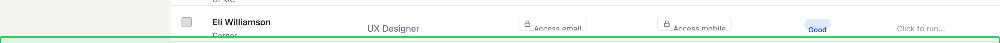
### Notes
this should be fixed to the bottom, and the table inner contents should be the scroll view. the header area should be fixed in the origin position
---## fb-2026-02-26T04-04-45-056Z
- **Date:** 2/25/2026, 8:04:45 PM
- **URL:** `/diagnostic`
- **Status:** resolved
- **Resolution:** Switched to two-column grid layout pairing each root cause with its recommended fix. Removed narrow max-width constraint.
- **Screenshot:** 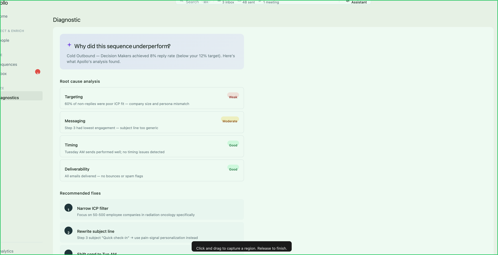
### Notes
redo the inner layour of the white area so that it fits better this kind of wide viewport. fixes dont need to be all the way down there. the root cause analysis items should be directly tied to the fixes, so use that in your redo.
---## fb-2026-02-26T04-12-14-853Z
- **Date:** 2/25/2026, 8:12:14 PM
- **URL:** `/home`
- **Status:** resolved
- **Resolution:** Redesigned as full-width dashboard grid — funnel + stacked metrics top row, coaching 2-col middle, CTA full-width bottom.
- **Screenshot:** 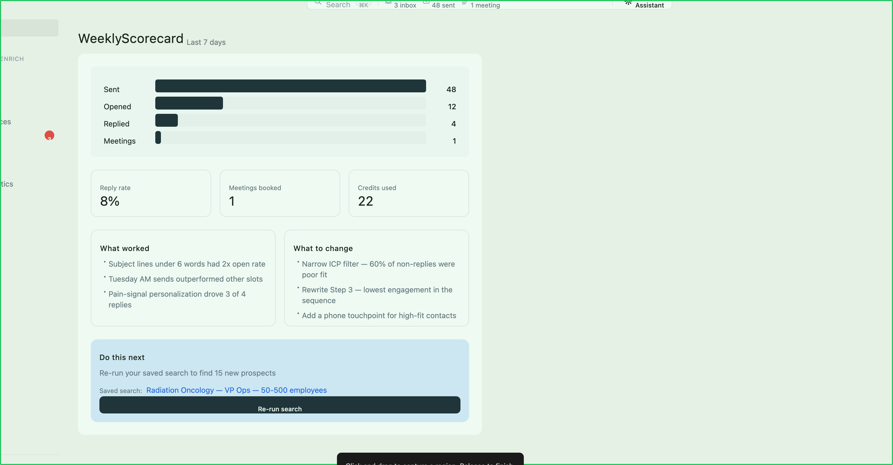
### Notes
i dont like how this card is so far on the left. can we come up with a more responsive design? more grid/dashboard? i like the scorecard idea just want it to scale out.
---## fb-2026-02-26T04-16-24-611Z
- **Date:** 2/25/2026, 8:16:24 PM
- **URL:** `/home`
- **Status:** resolved
- **Resolution:** Added time range toggles, industry/historical benchmark overlays, and conversion rates to funnel chart.
- **Screenshot:** 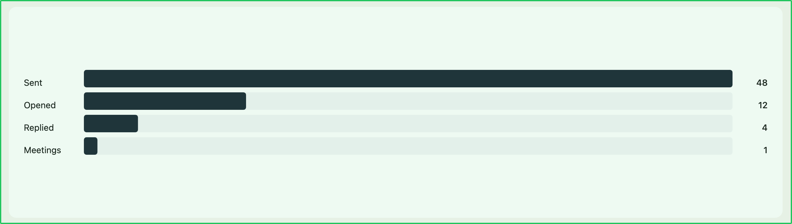
### Notes
this is kind of a boring chart, and lots of white space, there is no benchmarking against historical or my-industry standards... could we have interactivity here. add toggles/comparisons, take up more space. keep it still minimal design tho so be smart about it.
---## fb-2026-02-26T17-13-21-754Z
- **Date:** 2/26/2026, 9:13:21 AM
- **URL:** `/search`
- **Status:** resolved
- **Resolution:** Changed Enroll button in bulk action bar to navigate to `/sequences` (sequence picker) instead of `/enroll`.
- **Screenshot:** 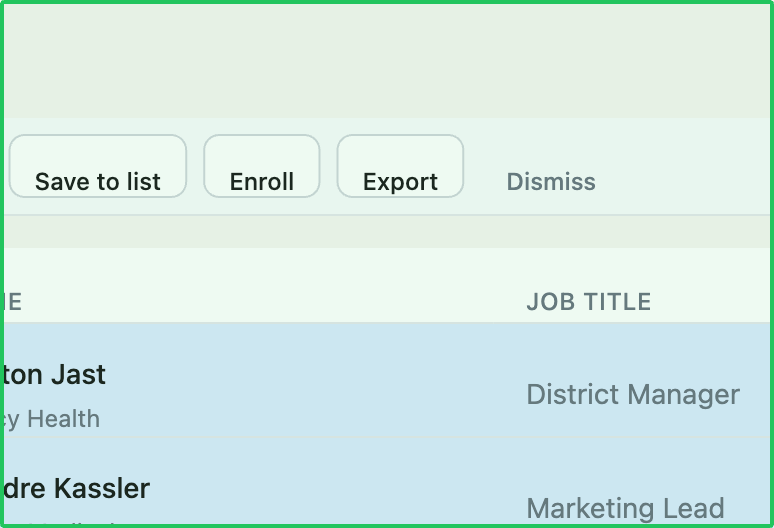
### Notes
This Enroll button should take the user to the sequence picker page instead of directly into the sequence editor page.
---## fb-2026-02-26T18-23-42-749Z
- **Date:** 2/26/2026, 10:23:42 AM
- **URL:** `/knowledge-base`
- **Status:** resolved
- **Resolution:** Changed company logo size from 40px to `var(--avatar-lg)` (48px) to match the person avatar circle.
- **Screenshot:** 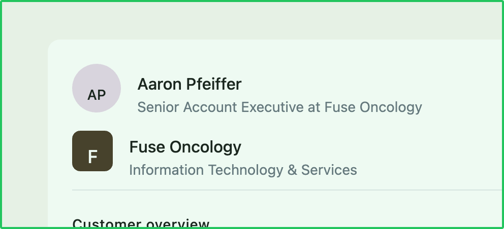
### Notes
Fix the alignment of the circle and the round rect for the person and company so that they are the same size.
---## fb-2026-02-26T20-22-46-993Z
- **Date:** 2/26/2026, 12:22:46 PM
- **URL:** `/search`
- **Status:** resolved
- **Resolution:** Removed duplicative "1 - 25 of 126,222" count from the sidebar filters. Pagination info remains in the table footer only.
- **Screenshot:** 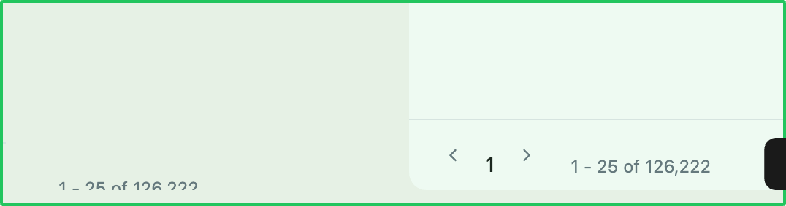
### Notes
get rid of the duplicative count on the table that is outside it
---## fb-2026-02-27T03-27-34-688Z
- **Date:** 2/26/2026, 7:27:34 PM
- **URL:** `/search`
- **Status:** resolved
- **Resolution:** Changed `.search-page-header` and `.search-liveness` to `align-items: baseline` so "People" heading and liveness text share the same baseline.
- **Screenshot:** 
### Notes
align the baseline of the text here between the header and the subtext
---## fb-2026-02-27T03-37-19-293Z
- **Date:** 2/26/2026, 7:37:19 PM
- **URL:** `/home`
- **Status:** resolved
- **Resolution:** Added `collapsed` state to Sidebar. Clicking `«` collapses to 56px icon-only mode. Labels, badges, group labels hidden. Black tooltip popovers on hover via `data-tooltip` + CSS `::after`. Chevron flips to `»`, appears on hover in collapsed mode. Clicking expands back. Smooth width transition.
- **Screenshot:** 
### Notes
the left facing chevron that shows up in the sidebar is intended to be a nav collapse mechanism. when you tap it, it should collapse the nav so only the icons show for each nav item. hovering over a nav item in this state should show the label in a black popover to the right of the icon. also in collapsed mode, the chevron should switch directions, sit directly next to the logo, and appear on hover, clicking will expand the nav.
---## fb-2026-02-27T03-41-02-234Z
- **Date:** 2/26/2026, 7:41:02 PM
- **URL:** `/assistant`
- **Status:** resolved
- **Resolution:** Fixed `.assistant-main` to use `align-items: center` (inheriting column flex from `search-table-frame`) so content centers horizontally within the white card.
- **Screenshot:** 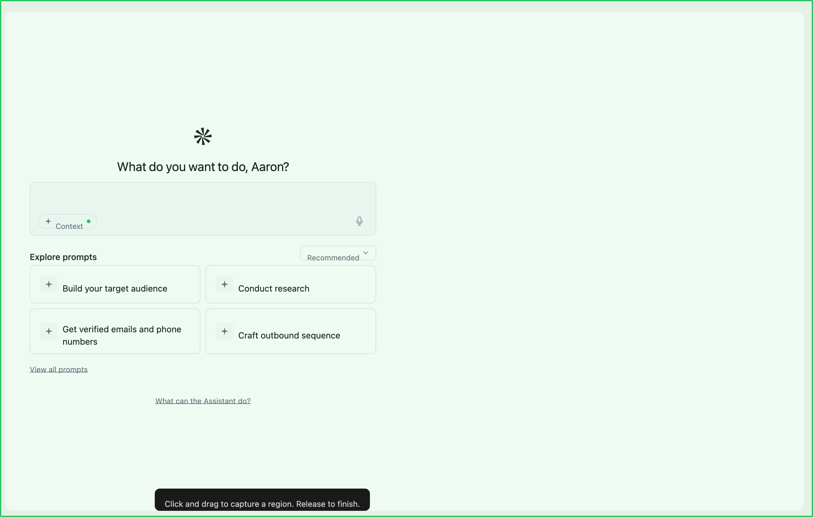
### Notes
for the blank state here, center the inner contents and anchor it toward the top.
---## fb-2026-02-27T03-45-21-782Z
- **Date:** 2/26/2026, 7:45:21 PM
- **URL:** `/home`
- **Status:** resolved
- **Resolution:** Fixed logo alignment to 20x20 matching nav icons, collapse button absolutely positioned so it doesn't shift logo. Added `overflow-x: hidden` to prevent trackpad horizontal scroll in collapsed mode.
- **Screenshot:** 
### Notes
i want the logo to be horizontally aligned with all the icons below and only offset on hover to reveal the chevron. this sidebar also seems to have a horizontal scroll that the user can use their trackpad to traverse which moves the entire contents out of view (in collapsed mode), so that needs to be fixed too
---## fb-2026-02-27T03-46-15-544Z
- **Date:** 2/26/2026, 7:46:15 PM
- **URL:** `/tasks`
- **Status:** resolved
- **Resolution:** Removed stats summary boxes (Urgent/Due today/Total) from the Tasks page sidebar.
- **Screenshot:** 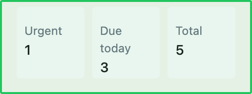
### Notes
remove this from this page.
---## fb-2026-02-27T03-46-52-424Z
- **Date:** 2/26/2026, 7:46:52 PM
- **URL:** `/tasks`
- **Status:** resolved
- **Resolution:** Reduced blocker card padding to `8px 12px`, removed left-side border. Added permanent design note: never use left-side border pattern.
- **Screenshot:** 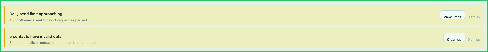
### Notes
reduce the height of these, remove the left-side border (claude, add note to never use this pattern of left side borders...)
---## fb-2026-02-27T03-47-49-512Z
- **Date:** 2/26/2026, 7:47:49 PM
- **URL:** `/enroll`
- **Status:** resolved
- **Resolution:** Changed sequence name from placeholder `*Sequence name here*` to `Cold Outbound — Decision Makers` with proper font-weight. Also added horizontal line separators between steps and improved text hierarchy.
- **Screenshot:** 
### Notes
Make up a Sequence Name (if you can use the card that was selected from the previous page, that would be great),
---## fb-2026-02-27T03-56-48-052Z
- **Date:** 2/26/2026, 7:56:48 PM
- **URL:** `/tasks`
- **Status:** resolved
- **Resolution:** Moved blocker bars from above the body into `.search-main` so they align with the table/round-rect area, to the right of the filter sidebar.
- **Screenshot:** 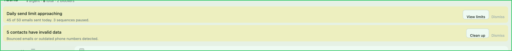
### Notes
i want the bars to be left-aligned to the round-rect table so that the view controls/filters etc are in their standard position
---## fb-2026-02-27T04-05-48-360Z
- **Date:** 2/26/2026, 8:05:48 PM
- **URL:** `/assistant`
- **Status:** resolved
- **Resolution:** Changed "Manage Context" link from `color-text-link` (blue) to `color-text-secondary` with standard nav hover style.
- **Screenshot:** 
### Notes
make this link not blue, make it like the other links in the nav stuff
---## fb-2026-02-27T04-20-57-309Z
- **Date:** 2/26/2026, 8:20:57 PM
- **URL:** `/sequences`
- **Status:** resolved
- **Resolution:** Added `white-space: nowrap; overflow: hidden; text-overflow: ellipsis` to sidebar item text spans.
- **Screenshot:** 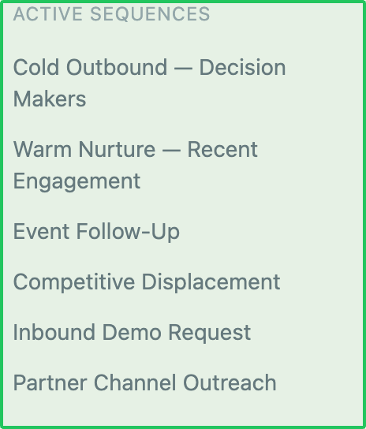
### Notes
i dont want these items to wrap. use elipseses
---## fb-2026-02-27T04-27-21-886Z
- **Date:** 2/26/2026, 8:27:21 PM
- **URL:** `/diagnostic`
- **Status:** resolved
- **Resolution:** Replaced purple insight banner with proper heading hierarchy (sequence name as `text-title-sm` + status badge). Replaced background-color metric boxes with typographic treatment (large 28px numbers separated by thin vertical dividers).
- **Screenshot:** 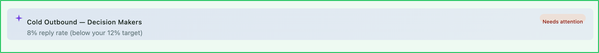
### Notes
this is missing heierarchy.. the name of the item should be pulled out of this badge and given a heading placement subordinate to the page header. give the stat callout a more typographic treatment as opposed to useing a background color.
---## fb-2026-02-27T04-48-54-168Z
- **Date:** 2/26/2026, 8:48:54 PM
- **URL:** `/lists`
- **Status:** resolved
- **Resolution:** Removed count badges from type filter tabs (All, People, Companies, Deals) so they fit within the sidebar width.
- **Screenshot:** 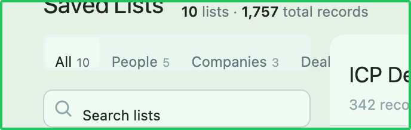
### Notes
Fix the spacing of ALL PEOPLE COMPANIES DEALS so it fits. Remove counts if that does it.
---## fb-2026-02-27T15-40-56-973Z
- **Date:** 2/27/2026, 7:40:56 AM
- **URL:** `/search`
- **Status:** resolved
- **Resolution:** Added `align-self: center` to `.page-header-left` and `.page-header-right` groups so the toggle icon and other header controls align vertically with the title text, overriding the parent's `align-items: baseline`.
- **Screenshot:** 
### Notes
i want this icon to be better vertically alignd with the labels.
---## fb-2026-02-27T15-51-11-747Z
- **Date:** 2/27/2026, 7:51:11 AM
- **URL:** `/search`
- **Status:** resolved
- **Resolution:** Removed `min-width: 240px` from `.page-sidebar-inner` (was wider than the 224px content area inside `.search-filters`) and replaced with `min-width: 0; width: 100%` so sidebar content fits without clipping.
- **Screenshot:** 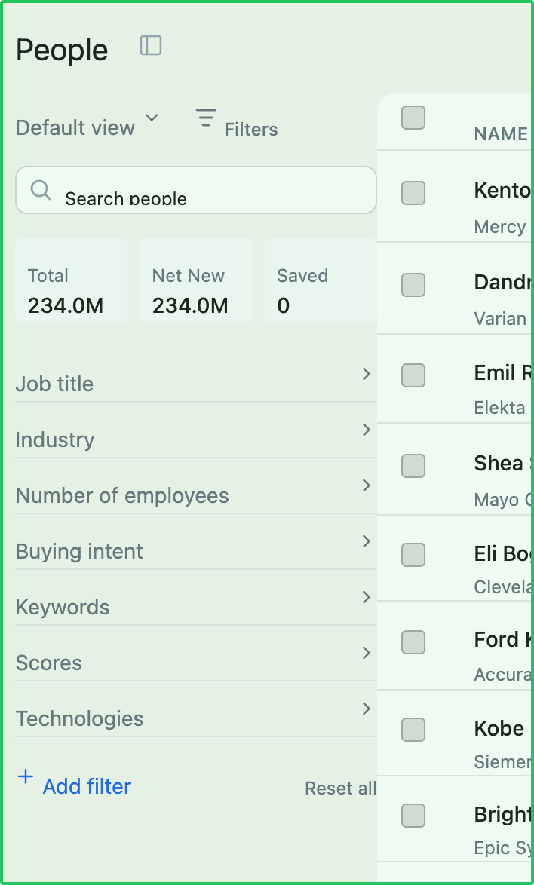
### Notes
update to the animation worked well, but now there is a clipping here, fix the padding plz
---## fb-2026-02-27T15-57-05-622Z
- **Date:** 2/27/2026, 7:57:05 AM
- **URL:** `/search`
- **Status:** resolved
- **Resolution:** Removed "Review contacts" button from pagination row. Added `actions` prop to PageLayout with dropdown menu (right-aligned). SearchPage now passes "Review contacts", "Export list", and "Save search" as action items.
- **Screenshot:** 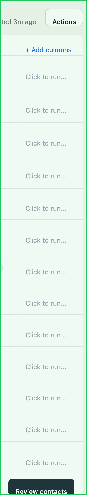
### Notes
ok for the find people, remove review contacts from the bottom of the table and add it to action menu.
---## fb-2026-03-04T03-58-34-147Z
- **Date:** 3/3/2026, 7:58:34 PM
- **URL:** `/search`
- **Status:** resolved
- **Resolution:** Ported `CrmSyncStatus` component from RKO prototype into Sidebar. Added above Settings in `sidebar-bottom`. Popover opens right of sidebar via `position: fixed` with button-rect calculation. Shows Salesforce status badge, synced stats with bars, recent activity log, diagnostics, and Sync Settings button. Green status dot on the item; repositions to icon top-right in collapsed mode.
- **Screenshot:** 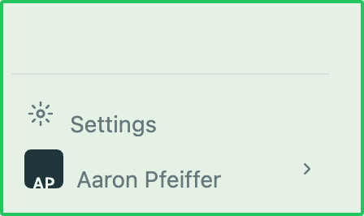
### Notes
Above the settings line item here, i want to bring over the CRM settings item and popover from the rko prototype in the reference folder.
---## fb-2026-03-04T04-01-00-017Z
- **Date:** 3/3/2026, 8:01:00 PM
- **URL:** `/search`
- **Status:** resolved
- **Resolution:** Added paper airplane icon + 3 green traffic-light dots between credits and metrics in the collapsed topbar pill (flanked by vertical dividers). In the expanded dropdown, added a "Sending health" section in the right column between credits and "This week" — lists each health item (Mailbox connected, Domain reputation, CRM sync) with label and chevron. Pre-connect state shows paper airplane icon + Configure CTA. Increased dropdown max-height from 400px to 520px to accommodate added content.
- **Screenshot:** 
### Notes
i want to add these three dots to the topbar between credits and the metrics (put between vertical lines). instead of a ready to send, put a tiny send-mail paper airplane icon. on the expanded version of the topbar, create a detailed section that shows the traffic lights vertically in a horizontal section between the credits and the metrics. each traffic light can show the label to the right and a chevron  to nav elsewhere(fake for now). before mailbox has been connected, have the paper airplane icon and a configure cta.
---## fb-2026-03-04T04-25-34-457Z
- **Date:** 3/3/2026, 8:25:34 PM
- **URL:** `/search`
- **Status:** resolved
- **Resolution:** Added "Create your own with AI" button below the "+ Add filter / Reset all" row in the search filter actions. Uses sparkle icon (purple accent) with caption text. The existing row was wrapped in `.search-filter-actions-main` and the AI button added as a second row.
- **Screenshot:** 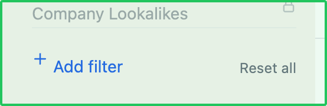
### Notes
add a 'create your own with ai' button in addition to + Add Filter somehow.
---## fb-2026-03-04T04-34-48-441Z
- **Date:** 3/3/2026, 8:34:48 PM
- **URL:** `/search`
- **Status:** resolved
- **Resolution:** Replaced mountain-shaped SVG with correct paper airplane path (`M11 1L5.5 6.5M11 1L7.5 11L5.5 6.5L1 4.5L11 1Z`) pointing up-right in both the collapsed and expanded topbar header health clusters, and the larger pre-connect state icon.
- **Screenshot:** 
### Notes
this icon isn't correct . it looks like a stacked mountain. it should be the line stroke equialent of paper airplane aiming up and to the right
---